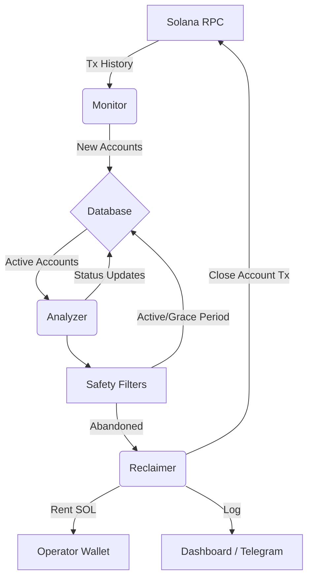

# Kora Rent Reclaim Bot 🤖💰

A specialised automation tool for **Kora Operators** to monitor sponsored accounts and reclaim locked rent from inactive or abandoned users.


## 📖 The Problem: The Hidden Cost of Sponsorship

### How Kora Works
**Kora** is an infrastructure layer that allows applications to "sponsor" transactions and account creation for their users. This provides a seamless, gas-less experience where the user doesn't need SOL to start using an app.

When a Kora Operator sponsors a user, they pay for:
1.  **Transaction Fees:** Small ephemeral costs.
2.  **Rent (State Storage):** A deposit of SOL required to keep data on-chain (e.g., Token Accounts, User Profiles).

### What is Rent Locking?
On Solana, every byte of data stored on-chain requires a SOL deposit called **Rent**.
*   A standard Token Account costs ~0.002 SOL.
*   A data account could cost more.

When thousands of users try an app and then leave, the **Rent SOL** paid by the Operator remains locked in those accounts forever. This creates a "capital leak" where the Operator's treasury slowly drains into abandoned accounts.

## 🛠 The Solution

The **Kora Rent Reclaim Bot** automates the recovery of this capital. It acts as a garbage collector for your sponsored accounts.

### Workflow
1.  **Monitor (`monitor.ts`)**: Scans the Operator's transaction history to identify every account they have funded or sponsored.
2.  **Analyze (`analyzer.ts`)**: Checks the current state of these accounts:
    *   *Is it still active?* (Recent transactions?)
    *   *Is it empty?* (Zero balance?)
    *   *Is it old enough?* (Past the 30-day "Grace Period"?)
3.  **Reclaim (`reclaim.ts`)**: If an account is deemed safe to close, the bot:
    *   Constructs a transaction to close the account.
    *   Sweeps the rent lamports back to the Operator's wallet.
    *   Logs the action for transparency.

---

## ✨ Features

*   **🛡 Safety First:**
    *   **Grace Period:** Accounts are immune from reclamation for 30 days after creation.
    *   **Activity Check:** Accounts with recent balance changes are skipped.
    *   **Whitelist:** Manually protect specific VIP addresses.
    *   **Authority Check:** Only claims accounts where the Operator has `CloseAuthority`.
*   **📊 Dashboard & Reporting:**
    *   Full web interface to view Active vs. Reclaimed stats.
    *   Clickable Audit Logs tracking every gathered Lamport.
    *   Daily Volume Charts.
*   **🔔 Alerts:**
    *   **Hourly High-Rent Alert:** Notifies Telegram if > 1 SOL is sitting idle.
    *   **Daily Summary:** Midnight reports on total reclaimed funds.

---

## 🚀 Getting Started

### Prerequisites
*   Node.js v18+
*   A Solana Keypair (The Kora Operator) - `operator.json`
*   RPC URL (Helius, Alchemy, or Devnet)

### Installation

1.  **Clone the repo**
    ```bash
    git clone https://github.com/superteam-ng/kora-rent-bot
    cd kora-rent-bot
    ```

2.  **Install Dependencies**
    ```bash
    cd kora-rent-bot && npm install
    cd ../kora-frontend && npm install
    ```

3.  **Configure Environment**
    Create `.env` in `kora-rent-bot`:
    ```env
    RPC_URL=https://api.devnet.solana.com
    OPERATOR_KEYPAIR=[123, 45, ...] # Array format
    TELEGRAM_BOT_TOKEN=your_token
    TELEGRAM_CHAT_ID=your_id
    PORT=3000
    ```

### Usage

**Run the Bot (Daemon Mode)**
Starts the hourly monitor and daily reclaimer.
```bash
npx tsx src/cli.ts bot
```

**Run the Dashboard**
```bash
# Terminal 1: API
npx tsx src/cli.ts serve

# Terminal 2: Frontend
npm run dev
```

**Manual Commands (CLI)**
```bash
npx tsx src/cli.ts scan --limit 1000  # Force a history scan
npx tsx src/cli.ts status             # Check database stats
npx tsx src/cli.ts reclaim            # Force a reclamation run
```

---

## 🏗 Architecture



## 📜 License
MIT
