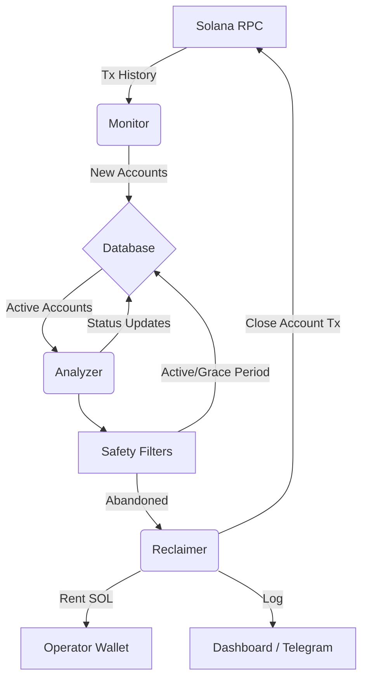

# Kora Rent Reclaim Bot 🤖💰

A specialised automation tool for **Kora Operators** to monitor sponsored accounts and reclaim locked rent from inactive or abandoned users.

Dashboard Preview(if needed)


## 📖 The Problem: The Hidden Cost of Sponsorship

### How Kora Works
**Kora** is an infrastructure layer that allows applications to "sponsor" transactions and account creation for their users. This provides a seamless, gas-less experience where the user doesn't need SOL to start using an app.

When a Kora Operator sponsors a user, they pay for:
1.  **Transaction Fees:** Small ephemeral costs.
2.  **Rent (State Storage):** A deposit of SOL required to keep data on-chain (e.g., Token Accounts, User Profiles).

### What is Rent Locking?
On Solana, every byte of data stored on-chain requires a SOL deposit called **Rent**.
*   A standard Token Account costs ~0.002 SOL.
*   A data account could cost more.

When thousands of users try an app and then leave, the **Rent SOL** paid by the Operator remains locked in those accounts forever. This creates a "capital leak" where the Operator's treasury slowly drains into abandoned accounts.

## 🛠 The Solution

The **Kora Rent Reclaim Bot** automates the recovery of this capital. It acts as a garbage collector for your sponsored accounts.

### Workflow
1.  **Monitor (`monitor.ts`)**: Scans the Operator's transaction history to identify every account they have funded or sponsored.
2.  **Analyze (`analyzer.ts`)**: Checks the current state of these accounts:
    *   *Is it still active?* (Recent transactions?)
    *   *Is it empty?* (Zero balance?)
    *   *Is it old enough?* (Past the 30-day "Grace Period"?)
3.  **Reclaim (`reclaim.ts`)**: If an account is deemed safe to close, the bot:
    *   Constructs a transaction to close the account.
    *   Sweeps the rent lamports back to the Operator's wallet.
    *   Logs the action for transparency.

### 🎯 Supported Reclamation Scenarios
The bot targets specific "Rent Leaks" in the Kora infrastructure.

### 🎯 Supported Reclamation Scenarios
The bot currently supports 3 distinct strategies for identifying and reclaiming rent.

#### 1. Kora Seed Accounts (Internal State)
*   **What are they?** System accounts derived from the Kora Operator's public key using a specific "seed" string. They are often used for internal logic like rate limiting, tracking user quotas, or temporary state.
*   **Why Reclaim?** Once the specific operation (e.g., a rate limit window) is over, these accounts are often abandoned, leaving ~0.00089 SOL locked per account.
*   **Detection:** Checks for `SystemProgram.createAccountWithSeed` where the `base` is the Operator.

#### 2. Transient wSOL Accounts (Failed Wrappers)
*   **What are they?** Temporary Wrapped SOL (wSOL) accounts used during complex transactions (like swaps or bridges) to convert native SOL into an SPL Token.
*   **Why Reclaim?** If a transaction pipeline fails mid-way, these accounts can be left open containing the rent deposit (~0.002 SOL). Since the Operator created them, the Operator owns them.
*   **Detection:** Checks for Token Accounts designated as `wSOL` `(So111...)` where the `Owner` is the Operator.

#### 3. "Right to Reclaim" ATAs (Atomic Delegation)
*   **What are they?** Standard SPL Token Accounts created for Users, but with a special "Insurance Policy" attached at creation.
*   **The Mechanism:** The Kora Client atomically executes two instructions in the setup transaction:
    1.  `CreateAssociatedTokenAccount` (Owner = User)
    2.  `SetAuthority` (Sets `CloseAuthority` = Operator)
*   **Why Reclaim?** This grants Kora the *Right (but not the obligation)* to close the account if the user abandons it. It does **not** allow Kora to move user funds, only to reclaim the rent if the balance is zero.
*   **Detection:** Checks for `SetAuthority` instructions delegating `CloseAccount` rights to the Operator.

### ⚙️ Procedure
1.  **Detection:** Monitor scans tx history. If matches one of the above, it's logged as `Active` in DB.
2.  **Grace Period:** Accounts sit in DB for 30 days to ensure user activity is finished.
3.  **Validation:** `Analyzer` checks on-chain: *Is Balance 0? Is Operator the Authority?*
4.  **Execution:** If Safe, `Reclaimer` builds and signs the `CloseAccount` transaction.


---

## ✨ Features

*   **🛡 Safety First:**
    *   **Grace Period:** Accounts are immune from reclamation for 30 days after creation.
    *   **Activity Check:** Accounts with recent balance changes are skipped.
    *   **Whitelist:** Manually protect specific VIP addresses.
    *   **Authority Check:** Only claims accounts where the Operator has `CloseAuthority`.
*   **🔓 Right to Reclaim (Atomic Delegation):**
    *   Detects user-owned ATAs where `CloseAuthority` was delegated to Kora at creation.
    *   Allows reclaiming rent from users who abandon their accounts, without needing their private key.
*   **📊 Dashboard & Reporting:**
    *   Full web interface to view Active vs. Reclaimed stats.
    *   Clickable Audit Logs tracking every gathered Lamport.
    *   Daily Volume Charts.
*   **🔔 Alerts:**
    *   **Hourly High-Rent Alert:** Notifies Telegram if > 1 SOL is sitting idle.
    *   **Daily Summary:** Midnight reports on total reclaimed funds.

---

## 🚀 Getting Started

### Prerequisites
*   Node.js v18+
*   A Solana Keypair (The Kora Operator) - `operator.json`
*   RPC URL (Helius, Alchemy, or Devnet)

### Installation

1.  **Clone the repo**
    ```bash
    git clone https://github.com/superteam-ng/kora-rent-bot
    cd kora-rent-bot
    ```

2.  **Install Dependencies**
    ```bash
    cd kora-rent-bot && npm install
    cd ../kora-frontend && npm install
    ```

3.  **Configure Environment**
    Create `.env` in `kora-rent-bot`:
    ```env
    RPC_URL=https://api.devnet.solana.com
    OPERATOR_KEYPAIR=[123, 45, ...] # Array format
    TELEGRAM_BOT_TOKEN=your_token
    TELEGRAM_CHAT_ID=your_id
    PORT=3000
    ```

### Usage

#### 1. CLI Commands (Terminal)
Use these for manual control or debugging.

| Command | Action | Description |
| :--- | :--- | :--- |
| `npm run bot` | **Start Daemon** | Runs the Telegram Bot + Scheduler (Hourly Monitor, Daily Reclaim). |
| `npm run monitor` | **Scan History** | Scans your transaction history for new accounts to track. |
| `npm run analyze` | **Check Status** | Updates balances and checks if accounts are empty/abandoned. |
| `npm run reclaim` | **Reclaim Rent** | Attempts to close all eligible "Reclaimable" accounts immediately. |
| `npm run serve` | **Start API** | Starts the backend API for the React Dashboard. |

#### 2. Telegram Bot Commands
Control the bot remotely via your Telegram chat.

| Command | Description |
| :--- | :--- |
| `/start` | Shows the welcome message and bot info. |
| `/status` | **Dashboard:** Shows Total, Active, and Reclaimable account counts. |
| `/balance` | Shows the current SOL balance of the Operator wallet. |
| `/scan` | Triggers a **Manual Scan** of the last 50 transactions. |
| `/reclaim` | Triggers a **Manual Reclamation** run immediately. |


### Development & Verification

To run the end-to-end regression tests (creating fresh accounts and reclaiming them):
```bash
# Seeds fresh accounts for all 3 scenarios:
# 1. Kora Native Seed
# 2. Transient wSOL
# 3. Right to Reclaim ATA
npx tsx src/scripts/test_reclamation_scenarios.ts

# Then run the bot cycle to clean them up:
npm run monitor && npm run analyze && npm run reclaim
```

---

## 🏗 Architecture



## 📜 License
MIT
